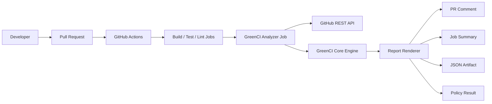
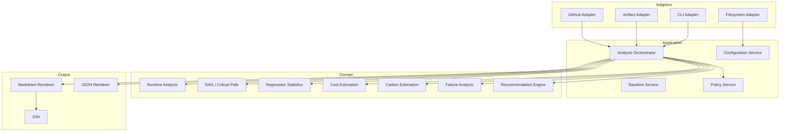

# GreenCI Technical Design Specification

> **Document status:** Implementation-ready  
> **Project:** GreenCI  
> **Target:** 2026 Open Source Developer Competition  
> **Primary implementation:** TypeScript, Node.js 24, GitHub JavaScript Action  
> **Last updated:** 2026-07-20  
> **License recommendation:** Apache License 2.0

---

## 0. How to use this document

This document is the implementation contract for GreenCI.

Codex and human contributors should treat the following keywords as requirements:

- **MUST**: mandatory for the specified release scope.
- **SHOULD**: expected unless a documented reason prevents it.
- **MAY**: optional.
- **MUST NOT**: prohibited.
- **P0**: essential competition MVP.
- **P1**: high-value differentiator to finish within the competition period.
- **P2**: stretch goal or post-competition work.

When implementation and this document disagree, create an Architecture Decision Record in `docs/adr/` before changing the design.

---

# 1. Executive summary

GreenCI is a GitHub-native CI efficiency analyzer.

It analyzes completed GitHub Actions jobs and steps, estimates runner cost and operational carbon emissions, detects regressions against a statistically robust baseline, identifies bottlenecks, and reports actionable recommendations directly inside a pull request.

GreenCI is not merely a carbon calculator.

Its product identity is:

> **A CI performance regression and resource waste detector that explains developer impact in time, cost, and carbon.**

The primary user flow is:

```text
Developer opens a pull request
        ↓
Existing build, test, lint, and security jobs run
        ↓
GreenCI runs after those jobs with `if: always()`
        ↓
GreenCI reads workflow metadata through the GitHub API
        ↓
GreenCI analyzes runtime, parallelism, failures, cost, and carbon
        ↓
GreenCI compares the run with a robust baseline
        ↓
GreenCI updates one PR comment and one Job Summary
        ↓
Optional policy rules warn or fail the GreenCI job
```

The system MUST run without a GreenCI-operated server or database.

The default runtime network boundary MUST be limited to GitHub APIs. Carbon intensity, runner power, and price models MUST be bundled as versioned datasets so that results remain reproducible and user data is not sent to external services.

---

# 2. Problem statement

GitHub Actions makes CI/CD easy to adopt, but teams often accumulate inefficient workflows:

- dependencies are repeatedly installed across jobs;
- unnecessarily large test matrices run on every pull request;
- slow integration tests become the dominant merge delay;
- failures are discovered late in the pipeline;
- build artifacts are regenerated instead of reused;
- workflow runtime gradually regresses;
- developers cannot connect runner consumption with cost or environmental impact.

GitHub exposes job, step, status, runner, and timing information, but developers must manually inspect multiple screens to understand the overall pipeline.

GreenCI turns this fragmented execution metadata into a single review-time decision:

```text
Did this pull request make CI slower or more expensive?
Where did the increase occur?
How confident is the comparison?
What can the developer change?
```

---

# 3. Product goals

## 3.1 Primary goals

GreenCI MUST:

1. Install as a GitHub JavaScript Action.
2. Require no external GreenCI server or user account.
3. Analyze Workflow, Job, and Step timing.
4. Distinguish wall-clock elapsed time from total runner consumption.
5. Detect runtime regressions using multiple historical runs.
6. Estimate gross runner cost using versioned GitHub pricing data.
7. Estimate operational carbon emissions with an uncertainty interval.
8. Identify runtime hotspots and likely waste patterns.
9. Generate explainable recommendations with supporting evidence.
10. Publish a concise PR comment and detailed Job Summary.
11. Produce a versioned machine-readable JSON report.
12. Operate under least-privilege GitHub token permissions.
13. Never execute untrusted pull-request code.
14. Remain useful when PR comment permission is unavailable.
15. Expose all estimation assumptions and data provenance.

## 3.2 Competition differentiators

The following features are intended to demonstrate engineering depth beyond a basic reporting Action:

- **Robust statistical baselines:** median and Median Absolute Deviation instead of comparing only the latest run.
- **Workflow-shape fingerprints:** avoid misleading comparisons after a workflow structure change.
- **DAG-aware critical-path analysis:** identify jobs that affect developer wait time, not only total runner usage.
- **Parallelism analysis:** calculate average and peak concurrency and distinguish speed from resource consumption.
- **Uncertainty-aware carbon estimation:** deterministic Monte Carlo simulation with p05, p50, and p95 values.
- **Explainable policy engine:** every warning contains rule ID, evidence, confidence, and estimated impact.
- **Secure artifact parsing:** zip-slip protection, size limits, and XML parser hardening.
- **Supply-chain hardening:** committed distribution bundle, SBOM, artifact attestation, CodeQL, pinned Actions, and reproducible releases.
- **Offline replay CLI:** reproduce an analysis from fixture data without accessing a live repository.

## 3.3 Non-goals

The first competition release MUST NOT attempt to:

- measure physical electricity directly on GitHub-hosted runners;
- claim ISO/IEC 21031 certification or full SCI compliance;
- provide exact hardware-level CPU or memory telemetry;
- profile individual source-code functions;
- automatically modify user workflows;
- execute generated optimization patches;
- upload source code or logs to an AI service;
- host a web dashboard;
- maintain a central historical database;
- support GitLab, Jenkins, or CircleCI;
- guarantee exact invoice totals;
- infer exact GitHub data-center location when it is unavailable.

---

# 4. Target users and use cases

## 4.1 Primary users

### Open-source maintainer

Wants a zero-server tool that comments on pull requests and highlights CI regressions without introducing data collection.

### Development team

Wants to manage CI time and list-price-equivalent cost as an engineering budget.

### GreenOps or FinOps practitioner

Wants transparent, reproducible resource and carbon estimates tied to engineering changes.

### Contributor

Wants immediate feedback about how a pull request changed CI behavior.

## 4.2 Core use cases

### UC-01: Pull-request regression detection

A contributor opens a pull request. GreenCI compares the run with successful runs from the base branch and reports a statistically significant increase.

### UC-02: Bottleneck identification

GreenCI ranks the slowest jobs and steps, then separates critical-path bottlenecks from highly parallel resource consumers.

### UC-03: Failed pipeline analysis

GreenCI reports the failed job and step, time spent before failure, and optionally parses a bounded section of the failed job log.

### UC-04: CI budget enforcement

A repository defines acceptable regression thresholds in `.greenci.yml`. GreenCI reports, warns, or fails its own job when a threshold is exceeded.

### UC-05: Test report analysis

The test job uploads a JUnit XML artifact. GreenCI safely parses it and displays slow and failed test cases.

### UC-06: Offline replay

A contributor runs the CLI against a sanitized fixture to reproduce calculations and report output locally.

---

# 5. Success criteria

## 5.1 Functional success

The competition release is successful when it can:

- analyze at least Linux, Windows, and macOS GitHub-hosted runner labels;
- process workflows with serial, parallel, and matrix jobs;
- analyze failed, cancelled, skipped, and timed-out jobs;
- compare against at least seven historical successful runs;
- update a single PR comment instead of creating comment spam;
- produce identical carbon results for the same run, config, and model version;
- fall back to Job Summary when PR comment permission is denied;
- operate without checking out pull-request code.

## 5.2 Quality targets

| Metric | Target |
|---|---:|
| Unit-test line coverage | ≥ 85% |
| Branch coverage for calculation and policy modules | ≥ 80% |
| Core package use of `any` | 0 |
| TypeScript strict mode | Enabled |
| Maximum action bundle cold execution target | ≤ 15 seconds excluding GitHub API latency |
| Typical analysis for ≤ 50 jobs and 7 baselines | ≤ 30 seconds |
| Maximum memory target | ≤ 256 MB |
| Maximum failed-log bytes parsed per job | 2 MiB by default |
| Maximum annotations emitted | 20 by default |
| Deterministic report for identical inputs | Required |

## 5.3 Product success demonstration

The final demo MUST show:

1. A deliberately inefficient CI workflow.
2. A GreenCI report identifying the bottleneck.
3. A workflow optimization commit.
4. A second GreenCI report showing reduced runtime, cost, and carbon.
5. A policy gate changing from warning or failure to passing.
6. Calculation assumptions and model version visible in the report.

---

# 6. User experience and visual interface

GreenCI has no standalone web dashboard in the competition release.

The product UI exists inside GitHub:

```text
Pull Request
├── GreenCI job/check result
├── GreenCI PR comment
├── Optional file annotations
└── Link to Actions run
    ├── Detailed Job Summary
    └── JSON report artifact
```

## 6.1 PR comment

The PR comment is the primary product screen.

It MUST answer in this order:

1. Did CI improve or regress?
2. How large was the change?
3. Which jobs or steps caused it?
4. What should the developer do?
5. How was the estimate calculated?

Example:

```md
<!-- greenci-report:v1 -->

# 🌱 GreenCI Report

> ⚠ **Total runner usage increased by 28.4%**
> compared with the median of 7 successful runs on `main`.

| Metric | Baseline | Current | Change |
|---|---:|---:|---:|
| ⏱ Wall-clock time | 7m 42s | 8m 51s | ▲ 14.9% |
| 🖥 Runner time | 9m 20s | 11m 59s | ▲ 28.4% |
| 🌱 Carbon, p50 | 3.10 gCO₂eq | 4.05 gCO₂eq | ▲ 30.6% |
| 💵 List-price equivalent | $0.06 | $0.08 | ▲ 33.3% |

**Confidence:** High · **Workflow shape match:** 96%

## Critical-path bottlenecks

| Job / Step | Runtime | Contribution |
|---|---:|---:|
| `integration-test / Run tests` | 5m 42s | 48.1% |
| `build / Docker build` | 2m 31s | 21.2% |

## Recommendations

- `GCI-CACHE-001` 📦 Cache dependencies used by `npm ci`.
- `GCI-ORDER-001` ⚡ Move fast checks before integration tests.
- `GCI-REGRESSION-001` 📈 Inspect `integration-test`; its median runtime increased by 41%.

<details>
<summary>Estimation and data-quality details</summary>

- Runtime source: GitHub Actions API
- Carbon model: `runner-models@2026.07`
- Carbon interval: 3.46–4.91 gCO₂eq (p05–p95)
- Region source: Repository configuration
- Price model: `github-pricing@2026.07`
- GreenCI version: `1.0.0`

Carbon values are modeled operational emissions, not direct measurements.

</details>
```

## 6.2 Job Summary

The Job Summary MUST contain full details:

- run identity;
- job table;
- step table;
- critical path;
- concurrency analysis;
- baseline sample;
- failure details;
- recommendation evidence;
- policy evaluation;
- estimation formula and data quality;
- warnings and degraded-mode explanations.

## 6.3 Annotations

GreenCI MAY emit annotations through GitHub Actions workflow commands.

Annotations MUST only be emitted when:

- file path is repository-relative;
- line number is valid;
- parser confidence is above the configured threshold;
- the same diagnostic has not already been emitted;
- annotation count is below the configured limit.

Uncertain diagnostics MUST remain in the Job Summary.

## 6.4 JSON artifact

The default artifact name is:

```text
greenci-report
```

The main file is:

```text
greenci-report.json
```

The JSON schema MUST be versioned and documented.

## 6.5 Accessibility

The report MUST NOT depend on color alone.

Use:

- icon;
- textual state;
- signed percentage;
- accessible table labels.

Text bars such as `██████░░░░` MAY be used, but a numeric percentage MUST always be shown beside them.

---

# 7. System context



GreenCI MUST NOT require:

- an external GreenCI API;
- a GreenCI database;
- a GreenCI account;
- source-code upload.

---

# 8. Supported execution modes

## 8.1 Embedded analyzer mode

**Status:** P0 and recommended default.

GreenCI runs as the final job in the same workflow.

```yaml
name: CI

on:
  pull_request:
  push:
    branches: [main]

jobs:
  build:
    runs-on: ubuntu-latest
    steps:
      - uses: actions/checkout@<FULL_COMMIT_SHA>
      - run: npm ci
      - run: npm run build

  test:
    runs-on: ubuntu-latest
    steps:
      - uses: actions/checkout@<FULL_COMMIT_SHA>
      - run: npm ci
      - run: npm test

  greenci:
    name: GreenCI
    if: always()
    needs: [build, test]
    runs-on: ubuntu-latest

    permissions:
      actions: read
      contents: read
      pull-requests: write

    steps:
      - name: Analyze CI efficiency
        uses: greenci-dev/greenci@<FULL_COMMIT_SHA>
        with:
          github-token: ${{ secrets.GITHUB_TOKEN }}
```

Advantages:

- simple installation;
- previous jobs are complete because of `needs`;
- no privileged `workflow_run` trigger;
- no checkout required in GreenCI job;
- direct Job Summary and job conclusion.

Limitations:

- GreenCI's own job is still running during analysis and MUST be excluded;
- fork pull requests may have read-only token permissions;
- a user must list upstream jobs in `needs`.

## 8.2 Post-workflow mode

**Status:** P2 experimental.

A separate workflow runs on `workflow_run`.

This mode can analyze a fully completed run but has a larger security surface. It MUST NOT check out untrusted PR code. Artifacts from upstream workflows MUST be treated as untrusted input.

The competition version SHOULD document the mode but SHOULD prioritize embedded mode.

---

# 9. High-level architecture

GreenCI uses a ports-and-adapters architecture.



## 9.1 Architectural rules

- Domain code MUST be independent of `@actions/*`.
- GitHub API types MUST be converted into GreenCI domain types at the adapter boundary.
- Calculation modules MUST be pure functions wherever practical.
- File, network, clock, and random-number dependencies MUST be injected.
- Carbon simulation MUST use a seeded pseudo-random generator.
- Zod MUST validate external configuration and persisted JSON.
- `unknown` MUST be used at untrusted boundaries; `any` MUST NOT be used in core code.
- Report rendering MUST consume a complete domain result and MUST NOT call GitHub APIs.

---

# 10. Repository structure

Use a pnpm workspace monorepo.

```text
greenci/
├── action.yml
├── package.json
├── pnpm-workspace.yaml
├── pnpm-lock.yaml
├── tsconfig.base.json
├── LICENSE
├── SECURITY.md
├── CONTRIBUTING.md
├── CODE_OF_CONDUCT.md
├── CHANGELOG.md
├── README.md
├── README.ko.md
│
├── packages/
│   ├── core/
│   │   ├── src/
│   │   │   ├── domain/
│   │   │   ├── analysis/
│   │   │   ├── estimation/
│   │   │   ├── policy/
│   │   │   ├── recommendation/
│   │   │   ├── reporting/
│   │   │   └── index.ts
│   │   └── tests/
│   │
│   ├── github-action/
│   │   ├── src/
│   │   │   ├── adapters/
│   │   │   ├── config/
│   │   │   ├── entrypoint.ts
│   │   │   └── run.ts
│   │   ├── tests/
│   │   └── dist/
│   │       └── index.js
│   │
│   └── cli/
│       ├── src/
│       └── tests/
│
├── data/
│   ├── runner-models.json
│   ├── carbon-intensity.json
│   ├── github-pricing.json
│   ├── recommendation-rules.json
│   └── manifest.json
│
├── schemas/
│   ├── config.schema.json
│   └── report-v1.schema.json
│
├── docs/
│   ├── architecture.md
│   ├── methodology.md
│   ├── security-model.md
│   ├── data-sources.md
│   ├── demo.md
│   └── adr/
│       ├── 0001-no-external-server.md
│       ├── 0002-robust-baseline.md
│       ├── 0003-carbon-uncertainty.md
│       └── 0004-embedded-mode-default.md
│
├── fixtures/
│   ├── workflow-runs/
│   ├── job-logs/
│   ├── junit/
│   └── expected-reports/
│
├── scripts/
│   ├── update-pricing.ts
│   ├── validate-data.ts
│   ├── generate-schemas.ts
│   └── verify-dist.ts
│
└── .github/
    ├── workflows/
    │   ├── ci.yml
    │   ├── codeql.yml
    │   ├── scorecard.yml
    │   ├── release.yml
    │   └── data-update.yml
    ├── dependabot.yml
    └── CODEOWNERS
```

## 10.1 Why a monorepo

The monorepo separates:

- reusable pure analysis logic;
- GitHub-specific integration;
- offline replay and validation.

This increases testability and demonstrates that GreenCI is an extensible open-source engine, not a one-file script.

---

# 11. Technology stack

| Area | Choice |
|---|---|
| Language | TypeScript |
| Runtime | Node.js 24 |
| Package manager | pnpm workspaces |
| Action type | GitHub JavaScript Action |
| GitHub integration | `@actions/core`, `@actions/github`, `@actions/artifact` |
| Validation | Zod |
| YAML | `yaml` |
| XML | `fast-xml-parser`, hardened configuration |
| Testing | Vitest |
| Property-based testing | fast-check |
| HTTP mocking | Nock |
| Bundling | `@vercel/ncc` |
| Linting | ESLint |
| Formatting | Prettier |
| CLI | Commander or Clipanion |
| Coverage | V8 coverage through Vitest |
| Security scanning | CodeQL, dependency review, OpenSSF Scorecard |
| Release management | Changesets or Release Please |
| SBOM | CycloneDX npm tooling |
| Provenance | GitHub artifact attestations |

## 11.1 TypeScript compiler requirements

`tsconfig.base.json` MUST enable:

```json
{
  "compilerOptions": {
    "strict": true,
    "noUncheckedIndexedAccess": true,
    "exactOptionalPropertyTypes": true,
    "noImplicitOverride": true,
    "noFallthroughCasesInSwitch": true,
    "useUnknownInCatchVariables": true,
    "verbatimModuleSyntax": true
  }
}
```

---

# 12. Action metadata contract

Example `action.yml`:

```yaml
name: GreenCI
description: Analyze GitHub Actions runtime, cost, carbon, and CI regressions
author: GreenCI Contributors

branding:
  icon: activity
  color: green

inputs:
  github-token:
    description: GitHub token used to read Actions data and update PR comments
    required: true

  config-path:
    description: Repository-relative path to GreenCI configuration
    required: false
    default: .greenci.yml

  locale:
    description: Report locale, en or ko
    required: false
    default: en

  baseline-runs:
    description: Number of successful base-branch runs to analyze
    required: false
    default: "7"

  parse-failure-logs:
    description: Parse bounded failed-job logs locally
    required: false
    default: "false"

  upload-report-artifact:
    description: Upload greenci-report.json as an artifact
    required: false
    default: "true"

outputs:
  report-path:
    description: Path to greenci-report.json

  runner-seconds:
    description: Total analyzed runner time in seconds

  carbon-p50-grams:
    description: Median estimated operational emissions

  carbon-p95-grams:
    description: p95 estimated operational emissions

  list-price-usd:
    description: Estimated gross list-price equivalent

  policy-conclusion:
    description: pass, warn, fail, or skipped

runs:
  using: node24
  main: packages/github-action/dist/index.js
```

---

# 13. Configuration design

Configuration precedence:

```text
Action input
    > .greenci.yml
        > bundled defaults
```

Unknown keys MUST fail validation by default to catch typos.

Example `.greenci.yml`:

```yaml
version: 1

locale: en

report:
  pr-comment: true
  job-summary: true
  update-existing-comment: true
  top-hotspots: 5
  annotations:
    enabled: true
    max-count: 20
    min-confidence: 0.9

baseline:
  branch: main
  successful-runs: 7
  max-runs: 20
  minimum-samples: 3
  workflow-shape-threshold: 0.8
  statistics:
    method: median-mad
    regression-percent: 15
    modified-z-score: 3.5

analysis:
  exclude-current-job: true
  include-runner-setup-steps: false
  critical-path:
    enabled: true
    parse-workflow-dag: true
  failure-logs:
    enabled: false
    max-bytes-per-job: 2097152
    max-jobs: 3
    tail-lines: 2000
  test-reports:
    - artifact: test-results
      format: junit
      glob: "**/*.xml"
      max-uncompressed-bytes: 10485760

carbon:
  enabled: true
  region: KR
  model: operational-v1
  simulation-samples: 2000
  pue:
    min: 1.10
    mode: 1.20
    max: 1.35
  utilization:
    min: 0.35
    mode: 0.65
    max: 0.95
  show-uncertainty: true

cost:
  enabled: true
  show-public-runner-equivalent: true
  pricing-model: github-2026-07

policy:
  default-mode: warn
  rules:
    - metric: runner-time-regression-percent
      operator: greater-than
      value: 20
      mode: fail
      minimum-confidence: medium

    - metric: carbon-p95-grams
      operator: greater-than
      value: 10
      mode: warn

recommendations:
  enabled: true
  minimum-confidence: 0.65
  max-count: 5

privacy:
  allow-external-network: false
  retain-downloaded-logs: false
```

---

# 14. Domain model

Core types MUST not expose Octokit response shapes.

```ts
export type Conclusion =
  | 'success'
  | 'failure'
  | 'cancelled'
  | 'skipped'
  | 'timed_out'
  | 'neutral'
  | 'action_required'
  | 'unknown';

export interface WorkflowRunIdentity {
  owner: string;
  repository: string;
  workflowId: number;
  workflowPath: string;
  runId: number;
  runAttempt: number;
  headSha: string;
  headBranch: string;
  baseBranch?: string;
  event: string;
  pullRequestNumber?: number;
  repositoryVisibility: 'public' | 'private' | 'internal';
}

export interface NormalizedStep {
  index: number;
  name: string;
  normalizedName: string;
  startedAt?: string;
  completedAt?: string;
  durationSeconds?: number;
  conclusion: Conclusion;
  isRunnerInternal: boolean;
}

export interface NormalizedJob {
  id: number;
  apiName: string;
  logicalJobId?: string;
  matrixSignature?: string;
  runnerLabels: string[];
  runnerClass: string;
  startedAt?: string;
  completedAt?: string;
  durationSeconds?: number;
  conclusion: Conclusion;
  steps: NormalizedStep[];
}

export interface BaselineDistribution {
  sampleCount: number;
  median: number;
  mad: number;
  p25: number;
  p75: number;
  min: number;
  max: number;
}

export interface EstimateInterval {
  p05: number;
  p50: number;
  p95: number;
  unit: string;
  modelVersion: string;
}

export interface Evidence {
  metric: string;
  observed: number | string;
  baseline?: number | string;
  source: string;
}

export interface Recommendation {
  ruleId: string;
  severity: 'info' | 'warning' | 'critical';
  title: string;
  explanation: string;
  confidence: number;
  evidence: Evidence[];
  estimatedImpact?: {
    runnerSeconds?: number;
    costUsd?: number;
    carbonGrams?: number;
  };
}
```

---

# 15. GitHub data collection

## 15.1 Required data

GreenCI collects:

- workflow run metadata;
- jobs for the current run attempt;
- step timing and conclusions;
- workflow definition YAML for DAG reconstruction;
- historical workflow runs;
- jobs for selected historical runs;
- optional failed job logs;
- optional test report artifacts;
- optional changed-file metadata for path-filter recommendations.

## 15.2 API strategy

The adapter SHOULD use Octokit pagination and bounded concurrency.

Default request pattern:

```text
1 × current workflow run
1 × current run-attempt jobs
1 × workflow YAML content
1 × list successful baseline runs
N × baseline run-attempt jobs, N defaults to 7
0–3 × failed job logs, opt-in
0–M × artifact metadata/download, opt-in
```

Historical requests MUST use concurrency no greater than 3 by default.

The adapter SHOULD retry transient failures:

- 502;
- 503;
- 504;
- secondary rate-limit responses when a retry delay is provided.

It MUST NOT retry:

- permission denied;
- validation errors;
- missing repository;
- invalid configuration.

## 15.3 Run attempt handling

A re-run can contain multiple attempts. GreenCI MUST analyze the current run attempt rather than merging old attempts into one report.

## 15.4 Current GreenCI job exclusion

The current job MUST be excluded by:

1. matching the current job name when available;
2. matching the job that contains the GreenCI Action step;
3. fallback matching a configured exclusion pattern.

The report MUST disclose when exclusion was heuristic.

## 15.5 Degraded modes

GreenCI MUST return a useful report even if some APIs fail.

Examples:

| Missing data | Behavior |
|---|---|
| Historical runs unavailable | Current-run-only report |
| Workflow YAML unavailable | Skip exact DAG, use interval analysis |
| PR write permission unavailable | Job Summary only |
| Runner model unknown | Runtime analysis only for that job |
| Carbon region unknown | Use configured global average and lower confidence |
| Failed log unavailable | Link to original job log |

---

# 16. Runtime analysis

## 16.1 Wall-clock elapsed time

```text
wallClock =
    max(job.completedAt)
  - min(job.startedAt)
```

This is the approximate developer waiting time covered by analyzed jobs.

## 16.2 Total runner time

```text
runnerTime = Σ job.durationSeconds
```

This measures consumed compute time.

Parallel jobs can produce:

```text
wall-clock time = 8 minutes
runner time     = 15 minutes
```

GreenCI MUST display both values.

## 16.3 Step time

Step duration is:

```text
max(0, completedAt - startedAt)
```

Steps with missing timestamps MUST be marked unavailable and excluded from percentage denominators.

## 16.4 Queue and orchestration time

When supported by the API:

```text
queueTime = job.startedAt - job.createdAt
```

The report MUST separate queue time from execution time.

A queue-time hotspot SHOULD NOT be reported as a code optimization opportunity.

## 16.5 Parallelism metrics

Use a sweep-line algorithm over job start and completion events.

Calculate:

- peak concurrency;
- average concurrency;
- concurrency over time;
- idle gaps;
- runner-time-to-wall-clock ratio.

```text
averageConcurrency = totalRunnerSeconds / wallClockSeconds
```

The result helps explain why a workflow may finish quickly while consuming many runner minutes.

---

# 17. Workflow shape and DAG analysis

## 17.1 Workflow shape fingerprint

A workflow shape fingerprint protects against invalid comparisons.

Normalize and hash:

- workflow path;
- logical job IDs;
- `needs` edges;
- runner classes;
- normalized user-step names;
- matrix dimensions when available.

Do not include:

- timestamps;
- commit SHA;
- status;
- random IDs.

Example:

```text
sha256(
  canonicalJson({
    jobs: [...],
    edges: [...],
    steps: [...]
  })
)
```

## 17.2 Shape similarity

When exact fingerprints differ, calculate a weighted similarity:

```text
shapeSimilarity =
    0.35 × jobIdJaccard
  + 0.25 × edgeJaccard
  + 0.25 × stepKeyJaccard
  + 0.15 × runnerClassMatch
```

Default comparison threshold:

```text
0.80
```

Below the threshold:

- whole-workflow regression confidence MUST be lowered;
- unmatched nodes MUST not be compared;
- report MUST explain that workflow structure changed.

## 17.3 DAG reconstruction

GreenCI SHOULD parse the exact workflow YAML used by the run, read `jobs.<id>.needs`, and build a directed acyclic graph.

Matrix jobs are expanded into API job nodes. If mapping is ambiguous:

- mark the DAG confidence;
- calculate a best-effort mapping;
- retain interval-based analysis as fallback.

## 17.4 Critical path

For a mapped DAG, compute the longest weighted path.

Node weight variants:

- execution duration;
- observed duration including queue time.

Output:

- critical path sequence;
- total critical-path duration;
- each node's path contribution;
- non-critical high-consumption jobs.

This distinction is important:

```text
Critical-path job:
    affects developer waiting time.

Parallel resource hotspot:
    may not affect waiting time but increases cost and carbon.
```

## 17.5 Fallback interval criticality

If DAG reconstruction fails, calculate:

- exclusive active time for each job;
- overlap ratio;
- wall-clock marginal contribution.

The report MUST label this as interval-based, not an exact DAG critical path.

---

# 18. Historical baseline and regression detection

## 18.1 Baseline selection

For pull requests:

- use the PR base branch;
- use the same workflow ID or workflow path;
- use successful completed runs;
- prefer the same event class when enough samples exist;
- exclude current run and duplicate attempts;
- default to 7 samples;
- maximum 20.

For push events:

- use the configured baseline branch;
- compare with preceding successful runs.

## 18.2 Why the latest run is not enough

CI runtimes contain noise:

- runner host variation;
- network package-download variation;
- cache hit or miss;
- test flakiness;
- external service delay.

Comparing only one run can produce false alarms.

GreenCI MUST use robust statistics.

## 18.3 Median and MAD

For sample values \(x_1 ... x_n\):

```text
median = median(samples)

MAD = median(|x_i - median|)
```

Modified z-score:

```text
z = 0.6745 × (current - median) / MAD
```

When MAD is zero:

- use percentage change;
- use interquartile range when possible;
- lower confidence if the sample is too uniform or too small.

## 18.4 Regression decision

A default runtime regression is detected when:

```text
percentageIncrease ≥ 15%
AND
modifiedZScore ≥ 3.5
AND
sampleCount ≥ 3
AND
shapeSimilarity ≥ 0.8
```

The thresholds are configurable.

## 18.5 Per-node regression

Compare jobs and steps by stable keys.

Recommended key components:

```text
workflowPath
logicalJobId
matrixSignature
normalizedStepName
stepOccurrenceIndex
runnerClass
```

The report SHOULD show:

- current duration;
- baseline median;
- percentage change;
- modified z-score;
- sample count;
- confidence.

## 18.6 Variability detection

A high normalized MAD indicates unstable CI behavior.

```text
normalizedMAD = MAD / median
```

If variability is high, GreenCI MAY recommend investigating flaky tests, network dependencies, or unstable caches.

---

# 19. Cost estimation

## 19.1 Cost terminology

GreenCI MUST distinguish:

- **Gross list-price equivalent:** runner usage multiplied by published rates.
- **Estimated billable cost:** best-effort estimate after known public/private rules.
- **Actual invoice cost:** unknown because plan credits and organization billing are unavailable.

The report MUST NOT call the gross estimate an exact charge.

## 19.2 Per-job rounding

GitHub rounds each job's partial minute up to a whole minute for priced runner use.

```text
billableMinutes(job) = ceil(durationSeconds / 60)
grossCost(job) = billableMinutes(job) × pricePerMinute
grossCost(run) = Σ grossCost(job)
```

Rounding MUST happen per job, not after summing all job durations.

## 19.3 Public repository behavior

Standard GitHub-hosted runner use can be free for public repositories.

GreenCI SHOULD display:

```text
Estimated charge: $0.00 under standard public-runner policy
List-price equivalent: $0.08
```

The list-price equivalent remains useful for cross-project comparison.

## 19.4 Price data

`data/github-pricing.json` MUST contain:

- SKU;
- runner class;
- architecture;
- cores when known;
- per-minute USD rate;
- effective date;
- source URL;
- retrieval date.

Unknown runner types MUST not silently inherit an unrelated price.

---

# 20. Carbon estimation methodology

## 20.1 Scope

GreenCI competition release estimates operational emissions for analyzed runner execution.

It uses the operational relationship:

```text
Operational emissions = Energy × Carbon intensity
```

This is aligned with the operational component used by the Green Software Foundation's SCI methodology, but GreenCI does not claim a complete SCI score because embodied emissions and certified boundaries are not included by default.

The functional unit is:

```text
one analyzed workflow run
```

## 20.2 Energy model

For each job:

```text
P_IT =
    P_idle
  + (P_peak - P_idle) × utilization
  + memoryGB × memoryWattsPerGB

E_IT = runtimeHours × P_IT / 1000

E_facility = E_IT × PUE
```

Run energy is the sum of job facility energy.

## 20.3 Why uncertainty is required

GitHub job metadata does not expose exact:

- CPU utilization;
- physical host model;
- shared-host allocation;
- instantaneous power;
- exact data-center region;
- data-center PUE.

A single precise-looking number would overstate certainty.

GreenCI MUST therefore produce:

- p05;
- p50;
- p95;
- data-quality grade;
- assumption list.

## 20.4 Deterministic Monte Carlo

Default simulation count:

```text
2000 samples
```

For each sample, draw from configured triangular distributions:

- utilization;
- idle and peak power range;
- PUE;
- regional carbon intensity range.

Use a deterministic seed derived from:

```text
sha256(runId + configHash + modelVersion)
```

Identical inputs MUST produce identical output.

Pseudo-code:

```ts
for (let i = 0; i < samples; i += 1) {
  let totalEnergyKwh = 0;

  for (const job of jobs) {
    const model = resolveRunnerModel(job.runnerClass);
    const utilization = triangular(
      config.utilization.min,
      config.utilization.mode,
      config.utilization.max,
      rng,
    );

    const pue = triangular(
      config.pue.min,
      config.pue.mode,
      config.pue.max,
      rng,
    );

    const powerWatts =
      model.idleWatts +
      (model.peakWatts - model.idleWatts) * utilization +
      model.memoryGb * model.memoryWattsPerGb;

    totalEnergyKwh +=
      (job.durationSeconds / 3600) *
      (powerWatts / 1000) *
      pue;
  }

  const intensity = sampleCarbonIntensity(regionModel, rng);
  samplesCarbon.push(totalEnergyKwh * intensity);
}
```

## 20.5 Data-quality score

Example weighted score:

| Component | Weight |
|---|---:|
| Runtime measured from GitHub | 0.30 |
| Runner class known | 0.20 |
| Runner power model quality | 0.20 |
| Region explicitly configured | 0.15 |
| Carbon dataset freshness | 0.10 |
| PUE source quality | 0.05 |

Map score to:

- High: ≥ 0.80
- Medium: ≥ 0.55
- Low: < 0.55

## 20.6 Carbon model output

```ts
export interface CarbonEstimate {
  energyKwh: EstimateInterval;
  operationalCarbonGrams: EstimateInterval;
  quality: {
    score: number;
    grade: 'high' | 'medium' | 'low';
    reasons: string[];
  };
  assumptions: Array<{
    key: string;
    value: string | number;
    source: string;
  }>;
}
```

## 20.7 Dynamic carbon APIs

External real-time carbon APIs are P2 and MUST be disabled by default.

If later enabled:

- require explicit opt-in;
- document destination domains;
- send no repository identifiers;
- cache only public carbon data;
- fall back to bundled datasets;
- record provider and timestamp in the report.

---

# 21. Failure and log analysis

## 21.1 Default behavior

P0 default:

- identify failed job;
- identify failed step;
- report duration before failure;
- link to original GitHub log;
- do not download logs unless enabled.

## 21.2 Opt-in log parsing

When enabled:

- download only failed job logs;
- limit job count;
- limit compressed and uncompressed bytes;
- process in memory;
- discard immediately after analysis;
- do not upload raw logs;
- do not print raw logs to GreenCI output;
- apply secret-like-pattern redaction before rendering snippets.

## 21.3 Parser architecture

```ts
export interface DiagnosticParser {
  readonly id: string;
  canParse(context: ParserContext): number;
  parse(input: string, context: ParserContext): Diagnostic[];
}
```

Initial parsers:

- TypeScript;
- ESLint;
- Jest and Vitest;
- Python traceback;
- pytest;
- Java stack trace;
- Gradle;
- Maven;
- GCC and Clang;
- generic exit-code parser.

Each diagnostic includes:

```ts
export interface Diagnostic {
  parserId: string;
  severity: 'error' | 'warning' | 'notice';
  message: string;
  file?: string;
  line?: number;
  column?: number;
  confidence: number;
  fingerprint: string;
}
```

## 21.4 Safe output

Diagnostic messages MUST be:

- length-limited;
- control-character sanitized;
- Markdown escaped;
- checked for repository-relative file paths;
- deduplicated.

---

# 22. Test report artifact analysis

## 22.1 Supported format

P1 MUST support JUnit XML.

Potential producers include:

- Jest JUnit;
- Vitest reporters;
- pytest `--junitxml`;
- Maven Surefire;
- Gradle test reports;
- many other CI tools.

## 22.2 Artifact security

Artifacts are untrusted data.

GreenCI MUST protect against:

- zip-slip paths;
- absolute paths;
- `..` traversal;
- excessive file count;
- decompression bombs;
- oversized XML;
- symbolic links;
- XML external entity expansion;
- deeply nested XML denial of service.

Default limits:

| Limit | Default |
|---|---:|
| Artifact compressed size | 10 MiB |
| Total uncompressed size | 10 MiB |
| File count | 100 |
| XML file size | 5 MiB |
| XML depth | bounded by parser/library support |
| Parsed test cases | 100,000 |

## 22.3 Output

GreenCI SHOULD show:

- tests;
- failures;
- skipped;
- total test time;
- slowest suites;
- slowest test cases;
- failed test cases;
- test-time regression if stable matching is possible.

---

# 23. Recommendation engine

## 23.1 Design principles

Recommendations MUST be:

- deterministic;
- explainable;
- evidence-backed;
- confidence-scored;
- bounded in number;
- phrased as suggestions, not guaranteed fixes.

No LLM is required.

## 23.2 Rule interface

```ts
export interface RecommendationRule {
  readonly id: string;
  readonly version: number;
  evaluate(context: AnalysisContext): Recommendation | null;
}
```

## 23.3 Initial rule catalog

### `GCI-CACHE-001`: Slow dependency installation

Evidence:

- step name matches known install patterns;
- step share exceeds threshold;
- same install step appears in multiple jobs.

Recommendation:

- dependency cache;
- lockfile-aware cache key;
- artifact reuse when appropriate.

### `GCI-DUP-001`: Repeated build or setup step

Evidence:

- normalized equivalent steps in multiple jobs;
- meaningful combined runner time.

Recommendation:

- build once;
- upload and reuse artifact;
- extract reusable workflow.

### `GCI-MATRIX-001`: Expensive matrix fan-out

Evidence:

- related matrix jobs;
- high aggregate runner time;
- low per-job failure diversity.

Recommendation:

- reduced PR matrix;
- full matrix on main or scheduled workflow.

### `GCI-ORDER-001`: Late failure

Evidence:

- failure occurs after a large proportion of total wall-clock time;
- faster checks exist but run later or in parallel without gating.

Recommendation:

- lint/type-check/unit tests earlier;
- fail-fast strategy where safe.

### `GCI-CRITICAL-001`: Critical-path bottleneck

Evidence:

- job or step dominates critical path.

Recommendation:

- split or parallelize the job;
- optimize that path before non-critical jobs.

### `GCI-REGRESSION-001`: Statistically significant regression

Evidence:

- percent threshold;
- modified z-score;
- enough baseline samples;
- workflow shape match.

### `GCI-FLAKY-001`: High runtime variability

Evidence:

- normalized MAD or IQR above threshold.

Recommendation:

- investigate network dependency, cache instability, or flaky test behavior.

### `GCI-QUEUE-001`: Runner queue pressure

Evidence:

- queue time dominates;
- execution itself is not the primary issue.

Recommendation:

- concurrency planning, runner capacity, or job scheduling rather than code optimization.

## 23.4 Estimated impact

Rules MAY estimate impact using observed evidence.

Example:

```text
Repeated `npm ci` consumes 170 seconds across two jobs.
Reusing a prepared dependency artifact could theoretically remove
up to 85 seconds of duplicate runner time per run.

This is an upper-bound estimate, not a guaranteed saving.
```

---

# 24. Policy engine

## 24.1 Purpose

The policy engine turns analysis into an enforceable CI budget.

It MUST be separate from recommendation logic.

## 24.2 Policy result

```ts
export type PolicyMode = 'report' | 'warn' | 'fail';

export interface PolicyEvaluation {
  ruleId: string;
  metric: string;
  actual: number;
  operator: string;
  threshold: number;
  mode: PolicyMode;
  passed: boolean;
  confidence: 'high' | 'medium' | 'low';
  explanation: string;
}
```

## 24.3 Supported metrics

P0:

- wall-clock regression percent;
- runner-time regression percent;
- list-price regression percent;
- carbon p50 regression percent;
- carbon p95 absolute grams;
- failed-job count;
- workflow-shape match.

P1:

- critical-path regression;
- peak concurrency;
- average concurrency;
- slow-test regression;
- queue-time percentage.

## 24.4 Job conclusion rules

Default behavior:

```text
No violated fail policies → success
Only report/warn policies violated → success with warnings
At least one fail policy violated → GreenCI job failure
Insufficient confidence → do not fail unless explicitly configured
```

The default installation MUST NOT block pull requests.

---

# 25. Reporting and output schema

## 25.1 Versioned JSON

Top-level example:

```json
{
  "schemaVersion": "1.0.0",
  "generatedAt": "2026-07-20T12:00:00Z",
  "greenciVersion": "1.0.0",
  "identity": {},
  "dataQuality": {},
  "current": {},
  "baseline": {},
  "regressions": [],
  "criticalPath": {},
  "parallelism": {},
  "cost": {},
  "carbon": {},
  "failures": [],
  "tests": {},
  "recommendations": [],
  "policies": [],
  "warnings": [],
  "dataManifest": {}
}
```

## 25.2 Schema compatibility

- Patch versions MAY add optional fields.
- Minor schema versions MAY add fields and enum values.
- Major schema versions MAY break compatibility.
- Consumers MUST ignore unknown optional fields.

## 25.3 PR comment idempotency

Use a hidden marker:

```html
<!-- greenci-report:v1 -->
```

Algorithm:

1. list PR comments;
2. find a comment authored by the current bot/token containing the marker;
3. update it;
4. create a new comment only when none exists.

The tool MUST never update another user's comment solely because it contains similar text.

## 25.4 Markdown safety

All repository-controlled strings MUST be escaped:

- job names;
- step names;
- branch names;
- diagnostic text;
- test names.

Long fields MUST be truncated with a visible marker.

---

# 26. Internationalization

## 26.1 Language policy

- source code: English;
- identifiers: English;
- console logs: English;
- JSON fields: English;
- default report: English;
- optional report locale: Korean.

## 26.2 Implementation

```text
packages/core/src/reporting/i18n/
├── en.ts
├── ko.ts
└── types.ts
```

All user-facing strings MUST use translation keys.

Metric names in machine-readable JSON MUST not be translated.

---

# 27. Security architecture

## 27.1 Least privilege

Runtime analyzer job:

```yaml
permissions:
  actions: read
  contents: read
  pull-requests: write
```

GreenCI MUST NOT require:

- `contents: write`;
- `packages: write`;
- `id-token: write`;
- repository secrets other than the automatically provided token.

Release workflows MAY require additional permissions for attestations, but those permissions MUST be scoped to release jobs.

## 27.2 No untrusted code execution

GreenCI MUST NOT:

- checkout pull-request code in the analyzer job;
- execute a command from a job name, branch name, config string, log, or artifact;
- use `eval`, `new Function`, or shell interpolation;
- run binaries from downloaded artifacts;
- load JavaScript plugins from the analyzed repository.

Workflow YAML and artifacts are data only.

## 27.3 Network policy

Default allowed network:

- GitHub API endpoints required by the Action.

External carbon API access is disabled.

The project MUST document all optional outbound destinations before adding any.

## 27.4 Log privacy

Downloaded logs may contain sensitive values despite platform redaction.

Therefore:

- log parsing is opt-in;
- raw logs are not persisted;
- snippets are sanitized;
- raw snippets are not included in JSON by default;
- no telemetry is collected;
- no external analytics SDK is included.

## 27.5 Supply-chain security

The repository MUST include:

- dependency lockfile;
- Dependabot;
- CodeQL;
- dependency review;
- OpenSSF Scorecard;
- CODEOWNERS for workflows and release files;
- third-party Actions pinned to full commit SHA;
- SBOM for releases;
- artifact attestation for Action bundles and release archives;
- security policy and vulnerability reporting process.

## 27.6 Distribution bundle

GitHub JavaScript Actions distribute bundled JavaScript.

`packages/github-action/dist/index.js` MUST be committed.

CI MUST fail if:

```text
source build output != committed dist output
```

This prevents unreviewed or stale distribution code.

---

# 28. Data governance

## 28.1 Versioned data manifest

`data/manifest.json` example:

```json
{
  "schemaVersion": 1,
  "datasets": [
    {
      "id": "github-pricing",
      "version": "2026.07",
      "path": "data/github-pricing.json",
      "source": "https://docs.github.com/en/billing/reference/actions-runner-pricing",
      "retrievedAt": "2026-07-20",
      "licenseNote": "Factual pricing data with source attribution",
      "sha256": "..."
    }
  ]
}
```

## 28.2 Dataset requirements

Each model MUST include:

- source;
- effective date;
- retrieval date;
- unit;
- uncertainty or range;
- license note;
- model version.

## 28.3 Updates

Data updates SHOULD be created as reviewable pull requests.

Automated scripts MAY fetch or validate public data, but generated changes MUST be reviewed before release.

## 28.4 Reproducibility

Every report MUST include:

- GreenCI version;
- dataset versions;
- config hash;
- simulation seed hash or identifier.

---

# 29. Reliability and error handling

## 29.1 Error taxonomy

```ts
export type GreenCIErrorCode =
  | 'CONFIG_INVALID'
  | 'GITHUB_PERMISSION_DENIED'
  | 'GITHUB_RATE_LIMITED'
  | 'CURRENT_RUN_NOT_FOUND'
  | 'JOBS_UNAVAILABLE'
  | 'BASELINE_UNAVAILABLE'
  | 'WORKFLOW_DAG_UNAVAILABLE'
  | 'RUNNER_MODEL_UNKNOWN'
  | 'CARBON_MODEL_UNAVAILABLE'
  | 'LOG_TOO_LARGE'
  | 'ARTIFACT_UNSAFE'
  | 'REPORT_PUBLISH_FAILED'
  | 'INTERNAL_ERROR';
```

## 29.2 Fatal versus non-fatal

Fatal:

- invalid required input;
- invalid configuration;
- current run cannot be identified;
- no current jobs can be analyzed;
- internal invariant violation.

Non-fatal:

- baseline unavailable;
- comment permission denied;
- one runner model unknown;
- optional log parse fails;
- optional artifact parse fails;
- one recommendation rule errors.

Non-fatal failures MUST appear in the report's warning section.

## 29.3 Structured logging

Console log format:

```text
[GreenCI] INFO  collection.current_jobs completed jobs=8 duration_ms=412
[GreenCI] WARN  baseline unavailable reason=permission_denied
[GreenCI] INFO  report.summary written
```

Debug mode MAY include request counts and timing, but MUST NOT print tokens, raw logs, or full API payloads.

---

# 30. Performance design

## 30.1 Complexity targets

For:

- J jobs;
- S total steps;
- B baseline runs;
- R recommendation rules;
- M Monte Carlo samples;

Expected local computation:

```text
Runtime normalization: O(J + S)
Interval sweep: O(J log J)
Baseline statistics: O(B × matched metrics)
Critical path: O(V + E)
Recommendations: O(R × context inspection)
Carbon simulation: O(M × J)
```

With defaults `M=2000`, `J≤100`, computation remains small in Node.js.

## 30.2 API request control

- paginate only when required;
- cap baseline count;
- concurrency limit 3;
- stop fetching historical jobs when enough compatible samples exist;
- skip log and artifact APIs unless enabled;
- display request count in debug summary.

## 30.3 Report limits

GitHub surfaces have size limits and readability constraints.

GreenCI SHOULD:

- show top 5 hotspots in PR comment;
- show top 20 in Job Summary;
- show top 20 diagnostics;
- place long details in collapsible sections;
- place full structured data in JSON artifact.

---

# 31. Testing strategy

## 31.1 Unit tests

Required modules:

- duration calculation;
- runner-time aggregation;
- wall-clock interval union;
- concurrency sweep;
- DAG longest path;
- shape fingerprint and similarity;
- median, MAD, percentile, modified z-score;
- per-job cost rounding;
- seeded random simulation;
- carbon percentile output;
- policy operators;
- recommendation rules;
- Markdown escaping;
- i18n completeness;
- config precedence.

## 31.2 Property-based tests

Use fast-check for invariants:

- runner time is never negative;
- wall-clock time is not greater than runner time when at least one job exists;
- adding a non-negative job cannot reduce total runner time;
- cost is non-negative;
- p05 ≤ p50 ≤ p95;
- identical seed and input produce identical carbon output;
- percentages never produce `NaN` or infinity in reports;
- DAG result remains valid for generated acyclic graphs.

## 31.3 Golden tests

Store sanitized API fixtures and expected Markdown/JSON outputs.

A change to report output MUST update reviewed golden files.

## 31.4 Adapter tests

Mock GitHub API:

- pagination;
- rerun attempts;
- 403 permissions;
- 404 missing logs;
- 429 or secondary rate limiting;
- partial job timestamps;
- unknown conclusions;
- fork pull requests.

## 31.5 Security tests

- malicious Markdown in job names;
- ANSI and control characters in logs;
- zip-slip artifact paths;
- compressed-size bomb fixture;
- XML entity payload;
- oversized diagnostics;
- fake file paths outside repository;
- config alias or YAML parser abuse;
- untrusted workflow string never reaches a shell.

## 31.6 End-to-end test repository

Create `greenci-demo` with controlled workflows:

- serial CI;
- parallel CI;
- matrix CI;
- intentionally slow install;
- intentionally late failure;
- JUnit artifact;
- optimized branch.

The demo repository is part of the competition evidence.

---

# 32. CI/CD for GreenCI itself

## 32.1 Pull-request pipeline

```text
format check
    ↓
lint
    ↓
type check
    ↓
unit + property tests
    ↓
coverage thresholds
    ↓
bundle action
    ↓
verify committed dist
    ↓
fixture replay / golden tests
    ↓
dependency review
    ↓
CodeQL
```

GreenCI SHOULD analyze its own CI pipeline, creating a self-hosting demonstration.

## 32.2 Release pipeline

On a signed version tag:

1. verify tag points to protected branch;
2. install from lockfile;
3. run full test suite;
4. build distribution bundle;
5. generate SBOM;
6. create release archive;
7. generate artifact attestation;
8. publish GitHub Release;
9. update major version tag only through protected workflow;
10. publish release notes.

Document both installation forms:

```yaml
# Convenient
uses: greenci-dev/greenci@v1

# Security-focused
uses: greenci-dev/greenci@<FULL_COMMIT_SHA>
```

---

# 33. CLI design

Package:

```text
@greenci/cli
```

Commands:

```bash
greenci validate .greenci.yml
greenci replay fixtures/run.json
greenci render greenci-report.json --locale ko
greenci explain GCI-CACHE-001
greenci data verify
```

## 33.1 Replay input

The CLI MUST accept sanitized normalized input rather than raw secrets or tokens.

Replay provides:

- deterministic debugging;
- issue reproduction;
- report development;
- competition demo without API dependency;
- contributor-friendly tests.

---

# 34. Public APIs and extension design

The core package MAY expose stable interfaces:

```ts
import {
  analyzeWorkflow,
  estimateCarbon,
  evaluatePolicies,
  renderMarkdownReport,
} from '@greenci/core';
```

The competition release SHOULD mark the programmatic API experimental unless compatibility tests are complete.

Repository-provided executable plugins MUST NOT be supported.

New parsers and rules are added through reviewed source contributions.

---

# 35. One-month implementation plan

## Week 1: Foundation and current-run analysis

### Deliverables

- pnpm workspace;
- strict TypeScript configuration;
- Action metadata;
- core domain types;
- GitHub adapter;
- current jobs and steps;
- wall-clock and runner-time metrics;
- concurrency analysis;
- basic Job Summary;
- fixture replay CLI;
- unit-test foundation.

### Exit criteria

- GreenCI runs in a real test repository.
- It lists jobs and steps with correct durations.
- It excludes its own analyzer job.
- It produces `greenci-report.json`.

## Week 2: Baseline, cost, carbon, and PR UI

### Deliverables

- historical baseline fetch;
- workflow shape fingerprint;
- median/MAD regression detection;
- cost model with per-job rounding;
- runner and carbon datasets;
- deterministic Monte Carlo;
- PR comment create/update;
- Korean and English report rendering;
- property-based tests.

### Exit criteria

- A PR report compares against seven baseline runs.
- Re-running updates one comment.
- Carbon p05/p50/p95 is reproducible.
- Unknown model conditions lower confidence rather than crash.

## Week 3: Critical path, recommendations, and secure diagnostics

### Deliverables

- workflow YAML DAG parser;
- critical-path analysis with confidence;
- initial recommendation rules;
- policy engine;
- optional failed-log parsers;
- JUnit artifact parser;
- annotation output;
- security test fixtures.

### Exit criteria

- Demo workflow identifies both critical-path and parallel resource hotspots.
- Policy gate can warn or fail.
- Unsafe artifact fixtures are rejected.
- At least five explainable recommendation rules work.

## Week 4: Production hardening and competition demonstration

### Deliverables

- CodeQL, Scorecard, Dependabot, dependency review;
- SBOM and artifact attestation release workflow;
- performance profiling;
- complete README and methodology;
- demo repository and before/after scenario;
- architecture diagrams;
- installation templates;
- release candidate;
- presentation screenshots and backup replay demo.

### Exit criteria

- `v1.0.0` release candidate is installable by full SHA.
- All CI checks pass.
- Dist bundle is reproducible.
- Demo shows measurable improvement.
- Documentation explains assumptions and limitations honestly.

---

# 36. Priority matrix

## P0: Must finish

- TypeScript JavaScript Action on Node.js 24;
- current run Job/Step timing;
- wall-clock vs runner time;
- runner cost estimate;
- carbon point and interval estimate;
- robust baseline using median/MAD;
- PR comment update;
- Job Summary;
- JSON artifact;
- configuration validation;
- least-privilege installation;
- fallback when comment fails;
- tests and documentation.

## P1: Judge-targeting differentiators

- workflow shape fingerprint;
- DAG critical path;
- concurrency analysis;
- recommendation engine;
- policy budget gate;
- deterministic Monte Carlo;
- JUnit analysis;
- optional failure parsers and annotations;
- replay CLI;
- data provenance manifest;
- SBOM and attestations.

## P2: Stretch

- real-time carbon APIs;
- GitHub App distribution;
- organization-wide history;
- GitLab adapter;
- web dashboard;
- self-hosted runner telemetry collector;
- embodied emissions model.

---

# 37. Acceptance test scenarios

## AT-01: Parallel runtime

Input:

```text
build: 5 minutes
test: 8 minutes
lint: 2 minutes
all start together
```

Expected:

```text
wall-clock ≈ 8 minutes
runner time ≈ 15 minutes
peak concurrency = 3
average concurrency ≈ 1.875
```

## AT-02: Per-job billing rounding

Input:

```text
job A: 61 seconds
job B: 59 seconds
Linux rate: $0.006/minute
```

Expected:

```text
job A billable: 2 minutes
job B billable: 1 minute
gross total: $0.018
```

## AT-03: Robust regression

Baseline seconds:

```text
100, 102, 99, 101, 98, 100, 300
```

Current:

```text
125
```

Expected:

- baseline dominated by median near 100, not mean distorted by 300;
- regression detected according to configured percent and z-score;
- sample count and outlier robustness visible.

## AT-04: Workflow structure change

Baseline jobs:

```text
build, test
```

Current jobs:

```text
build, unit-test, integration-test, security-scan
```

Expected:

- shape similarity reduced;
- unmatched jobs not presented as direct regressions;
- comparison confidence lowered;
- report states that workflow structure changed.

## AT-05: Unknown runner

Expected:

- runtime still reported;
- unknown runner warning;
- cost/carbon unavailable or partially excluded;
- no silent substitution.

## AT-06: Fork pull request

Expected:

- PR comment write fails gracefully;
- Job Summary remains available;
- analysis job does not fail solely because comment permission is unavailable.

## AT-07: Malicious artifact

Input contains:

```text
../../outside.xml
```

Expected:

- artifact rejected;
- no filesystem escape;
- warning shown;
- core analysis continues.

---

# 38. Competition demonstration script

## Scene 1: Install

Show a repository adding only the GreenCI job.

Message:

```text
No server, database, signup, or source-code upload is required.
```

## Scene 2: Inefficient run

The demo workflow contains:

- duplicate dependency install;
- full Node version matrix;
- late integration-test failure;
- no cache;
- expensive job not on critical path.

GreenCI reports:

- runner-time regression;
- critical path;
- aggregate matrix cost;
- carbon uncertainty;
- three recommendations;
- one policy warning.

## Scene 3: Optimize

Apply:

- dependency cache;
- build artifact reuse;
- reduced PR matrix;
- fast checks before integration tests;
- path-based conditions.

## Scene 4: Compare

GreenCI shows:

```text
Wall-clock time: -34%
Runner time:     -46%
List-price eq.:  -43%
Carbon p50:      -44%
```

## Scene 5: Trust

Open estimation details:

- data sources;
- model versions;
- uncertainty interval;
- no exact-measurement claim;
- no external telemetry;
- JSON output;
- SBOM and attested release.

This ending demonstrates not only a feature, but production-minded engineering.

---

# 39. Risks and mitigations

| Risk | Mitigation |
|---|---|
| Carbon estimate appears falsely precise | p05/p50/p95, assumptions, quality grade |
| Runner hardware differs from model | versioned ranges and unknown-model behavior |
| GitHub pricing changes | data manifest and update workflow |
| Baseline is noisy | median, MAD, minimum samples |
| Workflow changed | shape fingerprint and matched-node comparison |
| Matrix mapping is ambiguous | confidence score and interval fallback |
| Fork PR cannot comment | Job Summary fallback |
| Logs contain secrets | opt-in, bounded, local-only parsing |
| Artifact is malicious | archive and XML hardening |
| API rate limit | bounded baseline, concurrency limit, degraded mode |
| Markdown injection | escape all untrusted strings |
| Third-party Action compromise | pinned SHAs, CodeQL, Scorecard, SBOM, attestation |
| Feature scope becomes too large | P0/P1/P2 gates and weekly exit criteria |
| Demo relies on live API | offline replay CLI and stored fixtures |

---

# 40. Codex implementation rules

Codex MUST follow these rules while implementing GreenCI:

1. Read this design before modifying architecture.
2. Implement P0 before P1 and P2.
3. Do not add a web frontend or database.
4. Do not execute PR-provided code in the analyzer.
5. Keep `@actions/*` imports out of `packages/core`.
6. Validate all external inputs with Zod.
7. Use `unknown`, not `any`, at boundaries.
8. Add tests before or with each calculation feature.
9. Add property tests for numeric invariants.
10. Keep calculation functions pure and deterministic.
11. Use a seeded PRNG for carbon simulation.
12. Escape all Markdown generated from repository data.
13. Do not log tokens, API payloads, raw logs, or raw artifacts.
14. Treat failed log and artifact parsing as non-fatal.
15. Update `data/manifest.json` when datasets change.
16. Add an ADR for any significant design deviation.
17. Keep the Action bundle committed and verify it in CI.
18. Never manually edit the generated `dist/index.js`.
19. Use conventional commits.
20. Keep public functions documented with TSDoc.
21. Keep modules focused; avoid files larger than approximately 400 lines unless justified.
22. Prefer composition and plain functions over class-heavy frameworks.
23. Avoid hidden global state.
24. Ensure every recommendation exposes rule ID, evidence, and confidence.
25. Ensure every estimate identifies its model version.
26. Fail closed on unsafe artifacts, but degrade gracefully on unavailable optional data.
27. Do not claim direct energy measurement or certified SCI compliance.
28. Keep English as the source locale and verify Korean key completeness.
29. Run formatting, linting, type checking, tests, and bundle verification before committing.
30. Never weaken security controls merely to make a demo pass.

---

# 41. Definition of done for v1.0.0

GreenCI v1.0.0 is complete when:

- [ ] A repository can install GreenCI using one analyzer job.
- [ ] No checkout is required in the GreenCI job.
- [ ] Current jobs and steps are collected correctly.
- [ ] Wall-clock and total runner time are both reported.
- [ ] Parallelism metrics are reported.
- [ ] Seven-run median/MAD baseline works.
- [ ] Workflow shape compatibility is calculated.
- [ ] Cost is rounded per job using versioned price data.
- [ ] Carbon p05/p50/p95 is deterministic.
- [ ] Data-quality grade and assumptions are visible.
- [ ] PR comment is idempotently created or updated.
- [ ] Job Summary works without PR write permission.
- [ ] JSON report validates against schema.
- [ ] At least five recommendation rules are implemented.
- [ ] Policy engine supports report, warn, and fail.
- [ ] DAG critical path works for supported fixtures.
- [ ] JUnit artifact parser passes security tests.
- [ ] Optional failure parser never exposes raw logs.
- [ ] English and Korean reports render.
- [ ] Core test coverage reaches target.
- [ ] Property tests pass.
- [ ] CodeQL and dependency review pass.
- [ ] Dist verification passes.
- [ ] SBOM and artifact attestation are generated for release.
- [ ] Demo repository shows before-and-after improvement.
- [ ] README, methodology, security model, and contributing guide are complete.

---

# 42. Recommended initial issues

Create these GitHub issues in order:

1. `chore: initialize pnpm TypeScript workspace`
2. `feat(core): define workflow analysis domain model`
3. `feat(action): collect current workflow run jobs`
4. `feat(core): calculate wall-clock and runner time`
5. `feat(core): analyze concurrency`
6. `feat(report): render initial Job Summary`
7. `feat(cli): add fixture replay command`
8. `feat(baseline): collect historical successful runs`
9. `feat(statistics): implement median and MAD regression`
10. `feat(shape): fingerprint workflow structure`
11. `feat(cost): implement versioned GitHub runner pricing`
12. `feat(carbon): implement deterministic uncertainty model`
13. `feat(report): create and update PR comment`
14. `feat(dag): parse workflow needs graph`
15. `feat(dag): calculate critical path`
16. `feat(recommendations): add initial rule engine`
17. `feat(policy): add CI budget evaluation`
18. `feat(artifacts): safely parse JUnit reports`
19. `feat(diagnostics): add bounded failure parsers`
20. `security: add CodeQL, Scorecard, SBOM, and attestations`
21. `docs: publish methodology and security model`
22. `demo: build inefficient and optimized CI scenarios`
23. `release: prepare v1.0.0-rc.1`

---

# 43. Architecture decision summary

| Decision | Choice |
|---|---|
| Product surface | GitHub-native, no dashboard |
| Runtime | Node.js 24 JavaScript Action |
| Core language | TypeScript |
| Architecture | Ports and adapters with pure core |
| Default execution | Embedded final analyzer job |
| Baseline | Multiple successful runs, median/MAD |
| Workflow comparison | Shape-aware matched comparison |
| Developer delay | DAG critical path and wall-clock |
| Resource consumption | Total runner time and concurrency |
| Carbon | Operational estimate with deterministic interval |
| Cost | Per-job rounded list-price equivalent |
| Recommendations | Explainable deterministic rules |
| Enforcement | Configurable policy engine |
| Storage | No central database |
| Privacy | No telemetry, logs opt-in and ephemeral |
| Supply chain | Pinned Actions, SBOM, attestations |
| Extensibility | Core package and offline CLI |

---

# 44. References

The following sources should be rechecked whenever their dependent dataset or integration code changes.

1. GitHub Actions overview  
   https://docs.github.com/en/actions

2. GitHub Action metadata syntax and Node.js runtime configuration  
   https://docs.github.com/en/actions/reference/workflows-and-actions/metadata-syntax

3. GitHub workflow jobs REST API  
   https://docs.github.com/en/rest/actions/workflow-jobs

4. GitHub workflow runs REST API  
   https://docs.github.com/en/rest/actions/workflow-runs

5. GitHub Actions artifacts REST API  
   https://docs.github.com/en/rest/actions/artifacts

6. GitHub Actions workflow commands, annotations, and Job Summary  
   https://docs.github.com/en/actions/reference/workflows-and-actions/workflow-commands

7. GitHub-hosted runner specifications  
   https://docs.github.com/en/actions/reference/runners/github-hosted-runners

8. GitHub Actions runner pricing  
   https://docs.github.com/en/billing/reference/actions-runner-pricing

9. GitHub Actions secure-use reference  
   https://docs.github.com/en/actions/reference/security/secure-use

10. GitHub `GITHUB_TOKEN` authentication and permissions  
    https://docs.github.com/en/actions/reference/authentication-in-a-workflow

11. GitHub artifact attestations  
    https://docs.github.com/en/actions/concepts/security/artifact-attestations

12. Green Software Foundation Software Carbon Intensity specification  
    https://sci.greensoftware.foundation/

13. Green Software Foundation SCI guidance  
    https://sci-guide.greensoftware.foundation/

14. Cloud Carbon Footprint methodology and project  
    https://www.cloudcarbonfootprint.org/

---

# 45. Final product statement

GreenCI does not ask developers to care about an isolated carbon number.

It shows how a concrete code change affected:

- merge waiting time;
- consumed runner time;
- expected cost;
- modeled operational emissions;
- pipeline reliability.

The project succeeds when a developer can read one pull-request report, understand the bottleneck, improve the workflow, and verify the reduction in the next run.

> **Measure the pipeline. Explain the waste. Prevent the regression.**
